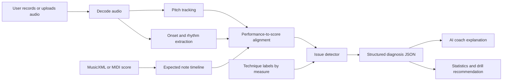

# ViolinMaster Technical Roadmap

## Architecture Goal

Use a score-driven audio analysis pipeline: MusicXML/MIDI provides the expected musical structure, user audio provides pitch and rhythm observations, and an AI coach translates the comparison into violin practice language.

## Recommended Stack

- App: Next.js + TypeScript
- Styling: Tailwind CSS with a restrained custom design system
- Notation: OpenSheetMusicDisplay for MusicXML rendering
- Audio recording: MediaRecorder + Web Audio API
- Local storage: IndexedDB for recent takes and analysis results
- Audio analysis MVP: browser-side extraction where feasible, with a future Python service option
- AI coach: structured JSON diagnosis generation, then natural-language coaching

## Pipeline



## Audio Input Layer

### Browser Recording

- Use `navigator.mediaDevices.getUserMedia`.
- Capture with `MediaRecorder`.
- Store raw take as Blob in IndexedDB.
- Decode with `AudioContext.decodeAudioData`.

### Upload

- Accept `wav`, `mp3`, `m4a`, and `webm` where browser decoding supports them.
- Normalize into mono PCM for analysis.

### Audio Quality Gate

Before analysis, estimate:

- Duration is plausible for selected piece or drill range.
- Signal level is not too quiet or clipped.
- Pitch confidence has enough stable frames.

## Analysis Libraries

### Pitch Detection

Candidates:

- `pitchy`: lightweight JavaScript pitch detection based on McLeod Pitch Method. Good for MVP and live pitch contour.
- `Essentia.js`: broader audio analysis toolkit with browser and Node usage. Better for onset/rhythm and advanced descriptors.
- `aubiojs`: WebAssembly build of aubio-style pitch/onset/tempo analysis. Useful fallback if Essentia integration is too heavy.

### Score and Notation

Candidates:

- `opensheetmusicdisplay`: render MusicXML in the browser.
- `@tonejs/midi`: parse MIDI and derive note timelines.
- `VexFlow`: lower-level notation rendering if OSMD is too restrictive.

### Future Python Service

If browser analysis becomes too limited:

- FastAPI service for heavier analysis.
- `librosa` for onset, tempo, chroma, and pitch-related processing.
- `music21` for symbolic score parsing and phrase/measure processing.

## Alignment Strategy

### MVP

1. Convert reference score to note events:
   - pitch name / MIDI number
   - expected onset beat
   - expected duration
   - measure number
2. Extract observed pitch frames and onset candidates from user audio.
3. Estimate tempo scaling between score and performance.
4. Align expected events to observed pitch regions with dynamic time warping or simpler phrase-level matching.
5. Create issue segments grouped by measure.

### Output Issue Types

```ts
type IssueType =
  | "pitch-high"
  | "pitch-low"
  | "rhythm-rush"
  | "rhythm-drag"
  | "unstable-tone"
  | "shifting-risk"
  | "fourth-finger-risk"
  | "bowing-risk"
  | "vibrato-risk";
```

## AI Coach Layer

The deterministic analyzer should produce structured facts first:

```ts
type DiagnosisSegment = {
  measureStart: number;
  measureEnd: number;
  issueTypes: IssueType[];
  severity: "low" | "medium" | "high";
  confidence: number;
  raw?: {
    pitchOffsetCents?: number;
    timingOffsetMs?: number;
  };
  learnerMessage: string;
  practiceSuggestion: string;
};
```

Then the AI coach rewrites and prioritizes:

- Top 3 issues.
- One next drill.
- One encouragement grounded in actual performance.
- A teacher-like explanation for the selected segment.

Use structured outputs so the UI is not dependent on free-form prose.

## UI Workstation Requirements

Follow the reference direction:

- Left vertical dock with mode icons.
- Top compact toolbar for piece, mode, save, analyze, profile.
- Central score/performance canvas.
- Bottom floating tool palette for timeline, metronome, loop, comments, coach.
- Right-side coach/statistics panel.
- Elegant classical violin visual language: walnut, varnish amber, ivory paper, charcoal, muted brass.

Primary screens:

1. Practice Workbench
2. Repertoire Library
3. Session History
4. Error Statistics
5. Coach Chat / Explanation Panel

## Milestones

### Phase 0: Planning and Design

- PRD approved.
- Technical roadmap approved.
- Visual prototype approved.
- Seed repertoire list approved.

### Phase 1: Project Foundation

- Next.js app scaffolded.
- Design tokens and workstation layout implemented.
- Seed repertoire metadata loaded.
- Local storage model created.

### Phase 2: Audio Input MVP

- Browser recording works.
- Upload works.
- Audio playback works.
- Processing states and errors are visible.

### Phase 3: First End-to-End Analysis

- Bundle one MusicXML/MIDI piece.
- Extract pitch contour.
- Generate basic pitch/rhythm issue segments.
- Render structured diagnosis in UI.

### Phase 4: Drill and Statistics

- Measure range selection.
- Drill analysis mode.
- Aggregate repeated error types across takes.
- AI suggested next drill.

### Phase 5: AI Coach

- Structured diagnosis prompt.
- Coach panel summaries.
- Segment-specific explanations.
- No raw cents/ms in learner-facing default view.

### Phase 6: Expansion

- Import user-provided MusicXML/MIDI.
- Add more bundled public-domain pieces.
- Add private dataset workflow for professor/player reference recordings.
- Explore real-time feedback once offline analysis is reliable.

## Validation Plan

- Build must pass.
- Recording and upload must be manually tested in browser.
- A known synthetic/simple audio sample should produce a plausible pitch contour.
- A supported piece should complete end-to-end analysis without fake placeholder results.
- UI states must cover loading, empty, error, disabled, and completed views.

## Open Decisions

- Whether to run all analysis in-browser for MVP or add a local API route/service.
- Which exact 5-10 pieces become first analysis-enabled assets.
- Whether MusicXML import is required in the first coding pass or immediately after the first bundled piece.
- Which AI model and provider will be used for structured coach output.
