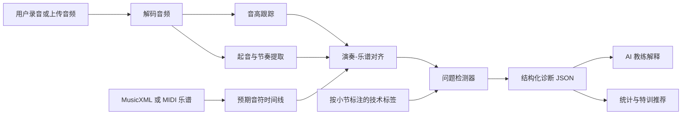

# ViolinMaster 技术路线图

## 架构目标

使用乐谱驱动的音频分析管线：MusicXML/MIDI 提供预期的音乐结构，用户音频提供音高和节奏观测，AI 教练再把比较结果翻译成小提琴练习语言。

## 推荐技术栈

- App：Next.js + TypeScript
- 样式：Tailwind CSS，并配合克制的自定义设计系统
- 乐谱：OpenSheetMusicDisplay 渲染 MusicXML
- 音频录制：MediaRecorder + Web Audio API
- 本地存储：IndexedDB 保存最近练习和分析结果
- 音频分析 MVP：可行时优先浏览器侧提取，未来可加入 Python 服务
- AI 教练：结构化 JSON 诊断生成，然后转为自然语言辅导

## 管线



## 音频输入层

### 浏览器录音

- 使用 `navigator.mediaDevices.getUserMedia`。
- 使用 `MediaRecorder` 采集。
- 将原始练习录音以 Blob 形式存入 IndexedDB。
- 使用 `AudioContext.decodeAudioData` 解码。

### 上传

- 在浏览器解码支持的前提下，接受 `wav`、`mp3`、`m4a` 和 `webm`。
- 归一化为单声道 PCM 供分析使用。

### 音频质量门槛

分析前估计：

- 时长对所选曲目或特训范围来说是否合理。
- 信号电平是否过低或削波。
- 音高置信度是否有足够稳定帧。

## 分析库

### 音高检测

候选：

- `pitchy`：轻量级 JavaScript 音高检测库，基于 McLeod Pitch Method。适合 MVP 和实时音高轮廓。
- `Essentia.js`：更完整的音频分析工具包，可在浏览器和 Node 中使用。更适合起音/节奏和高级描述符。
- `aubiojs`：aubio 风格音高/起音/速度分析的 WebAssembly 构建。如果 Essentia 集成过重，可作为备用方案。

### 乐谱与记谱

候选：

- `opensheetmusicdisplay`：在浏览器中渲染 MusicXML。
- `@tonejs/midi`：解析 MIDI 并生成音符时间线。
- `VexFlow`：如果 OSMD 限制过多，可作为更底层的记谱渲染方案。

### 未来 Python 服务

如果浏览器分析能力不足：

- 使用 FastAPI 服务做更重的分析。
- 使用 `librosa` 做起音、速度、色度和音高相关处理。
- 使用 `music21` 解析符号化乐谱和处理乐句/小节。

## 对齐策略

### MVP

1. 将参考乐谱转换为音符事件：
   - 音名 / MIDI 数字
   - 预期起始拍点
   - 预期时值
   - 小节号
2. 从用户音频中提取观测音高帧和起音候选。
3. 估计乐谱与演奏之间的速度缩放关系。
4. 用动态时间规整或更简单的乐句级匹配，将预期事件与观测音高区域对齐。
5. 按小节聚合生成问题片段。

### 输出问题类型

```ts
type IssueType =
  | "pitch-high"
  | "pitch-low"
  | "rhythm-rush"
  | "rhythm-drag"
  | "unstable-tone"
  | "shifting-risk"
  | "fourth-finger-risk"
  | "bowing-risk"
  | "vibrato-risk";
```

## AI 教练层

确定性分析器应先产出结构化事实：

```ts
type DiagnosisSegment = {
  measureStart: number;
  measureEnd: number;
  issueTypes: IssueType[];
  severity: "low" | "medium" | "high";
  confidence: number;
  raw?: {
    pitchOffsetCents?: number;
    timingOffsetMs?: number;
  };
  learnerMessage: string;
  practiceSuggestion: string;
};
```

然后由 AI 教练重写并排序：

- 前 3 个问题。
- 下一个特训任务。
- 一句基于真实表现的鼓励。
- 对所选片段给出类似老师的解释。

使用结构化输出，避免 UI 依赖自由文本。

## UI 工作台要求

遵循参考方向：

- 左侧垂直 dock，使用模式图标。
- 顶部紧凑工具栏，包含曲目、模式、保存、分析、个人资料。
- 中央乐谱/演奏画布。
- 底部悬浮工具面板，包含时间线、节拍器、循环、评论、教练。
- 右侧教练/统计面板。
- 优雅的古典小提琴视觉语言：胡桃木、清漆琥珀、象牙白谱纸、炭黑、低饱和黄铜色。

主要屏幕：

1. 练习工作台
2. 曲目库
3. 会话历史
4. 错误统计
5. 教练对话 / 解释面板

## 里程碑

### 阶段 0：规划与设计

- PRD 通过。
- 技术路线图通过。
- 视觉原型通过。
- 种子曲目列表通过。

### 阶段 1：项目基础

- 搭建 Next.js App。
- 实现设计 token 和工作台布局。
- 加载种子曲目元数据。
- 创建本地存储模型。

### 阶段 2：音频输入 MVP

- 浏览器录音可用。
- 上传可用。
- 音频回放可用。
- 处理状态和错误可见。

### 阶段 3：第一个端到端分析

- 内置一首 MusicXML/MIDI 曲目。
- 提取音高轮廓。
- 生成基础音准/节奏问题片段。
- 在 UI 中渲染结构化诊断。

### 阶段 4：特训与统计

- 小节范围选择。
- 特训分析模式。
- 汇总多次练习中的重复错误类型。
- AI 推荐下一段特训。

### 阶段 5：AI 教练

- 结构化诊断提示词。
- 教练面板总结。
- 片段级解释。
- 学习者默认视图不显示原始音分/毫秒。

### 阶段 6：扩展

- 导入用户提供的 MusicXML/MIDI。
- 增加更多内置公版曲目。
- 为教授/演奏家参考录音增加私人数据集工作流。
- 在离线分析可靠之后探索实时反馈。

## 验证计划

- 构建必须通过。
- 浏览器中必须手动测试录音和上传。
- 一个已知的合成/简单音频样本应能生成合理的音高轮廓。
- 一个受支持曲目应能完成端到端分析，且不是虚假的占位结果。
- UI 状态必须覆盖加载、空状态、错误、禁用和完成视图。

## 待定决策

- MVP 是否全部在浏览器内运行分析，还是加入本地 API 路由/服务。
- 哪 5-10 首曲目成为第一批可分析素材。
- MusicXML 导入是否必须放在第一轮编码中，还是紧跟第一首内置曲目之后实现。
- 结构化教练输出使用哪一个 AI 模型和供应商。
